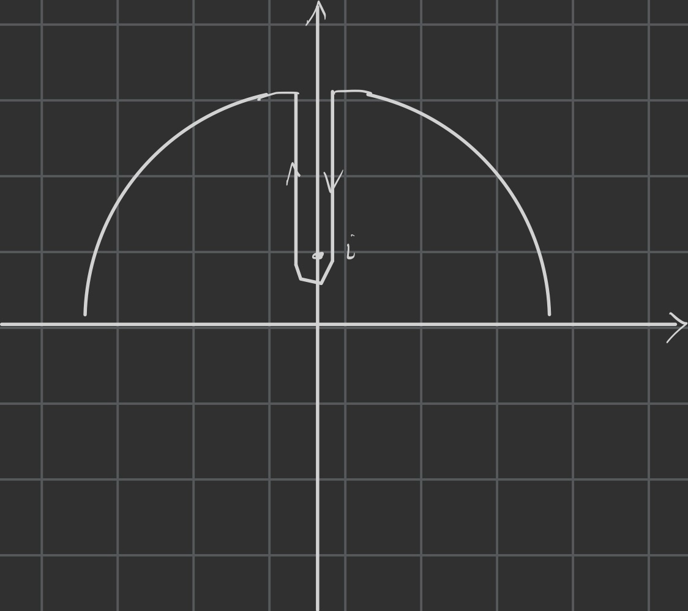

# 复变函数 第10次作业

Chasse_neige

### 3. 利用留数定理计算下面的积分  

(a)  
$$
\int_{0}^{\pi} \frac{dx}{1 - 2p \cos x + p^2}, \quad 0 < p < 1
$$

$$
\begin{aligned}
\int_{0}^{\pi} \frac{dx}{1 - 2p \cos x + p^2} &= \frac{1}{2} \oint_{|z| = 1} \frac{1}{1 - 2p \frac{z + \frac{1}{z}}{2} + p^{2}} \frac{d z}{i z} \\\\
&= \frac{i}{2} \oint_{|z| = 1} \frac{d z}{(pz - 1)(z - p)} = \frac{i}{2} (2 \pi i \text{Res} f (p)) = \frac{\pi}{1 - p^{2}}
\end{aligned}
$$

(b)  
$$
\int_{0}^{\pi} \frac{d\theta}{1 + \sin^2 \theta}
$$

$$
\begin{aligned}
\int_{0}^{\pi} \frac{d\theta}{1 + \sin^2 \theta} &= \frac{1}{2} \oint_{|z| = 1} \frac{1}{1 + (\frac{z- \frac{1}{z}}{2i})^{2}} \frac{dz}{i z} = \frac{1}{2} \oint_{|z| = 1} \frac{i 4z}{z^{4} - 6z^{2} + 1} dz \\\\
&= 2i \oint_{|z^{2}| = 1} \frac{d z^{2}}{z^{4} - 6 z^{2} + 1} = 2i (2 \pi i \text{Res} f(3 - 2 \sqrt{2})) \\\\
&= - 4 \pi \frac{1}{- 4 \sqrt{2}} = \frac{\sqrt{2} \pi}{2}
\end{aligned}
$$

### 4. 利用留数定理计算下面的积分  

(b)  
$$
\int_{-\infty}^{\infty} \frac{x^2 \, dx}{(x^2 + 1)(x^2 + 2x \cos \theta + 1)}, \quad \cos \theta \neq \pm 1
$$

取围道为上半平面逆时针。由于 $z \to \infty$ 时， $z \frac{z^2}{(z^2 + 1)(z^2 + 2z \cos \theta + 1)} \to 0$ ，所以根据大圆弧引理，实积分等于留数之和
$$
\begin{aligned}
\int_{-\infty}^{\infty} \frac{x^2 \, dx}{(x^2 + 1)(x^2 + 2x \cos \theta + 1)} &= 2 \pi i (\text{Res} f (i) + \text{Res} f (- \cos \theta + i \sin \theta)) \\\\
&= 2 \pi i (\frac{1}{4 \cos \theta} + \frac{- \sin \theta - i \cos \theta}{4 \cos \theta \sin \theta}) = \frac{\pi}{2 \sin \theta}
\end{aligned}
$$
(d)  
$$
\int_{0}^{\infty} \frac{dx}{(1+x^2)\cosh\frac{\pi x}{2}}
$$

如图取围道

处了刨去的一条之外，$z \to \infty$ 时 $z \frac{1}{(1 + z^{2}) \cosh z} \to 0$ ，所以根据大圆弧引理
$$
\begin{aligned}
\int_{0}^{\infty} \frac{dx}{(1+x^2)\cosh\frac{\pi x}{2}} &= \pi i \sum_{n = 1}^{\infty} \text{Res} f ((2n + 1) i)  =  \pi i (\frac{-i}{2 \pi} + \sum_{n = 1}^{\infty} \frac{(-1)^{n} i}{2 n (n + 1) \pi} ) \\\\
&= \frac{1}{2} (1 + \sum_{n = 1}^{\infty} \frac{(-1)^{n + 1}}{n (n + 1)}) = \frac{1}{2} (1 + 2 \ln 2 - 1) = \ln 2
\end{aligned}
$$

### 1. 利用留数定理计算下面的积分  

(a)  
$$
\int_{0}^{\infty} \frac{\cos x}{1 + x^4} \, dx  
$$

$$
\frac{\cos x}{1 + x^{4}}  = \Re [\frac{e^{ix}}{1 + x^{4}}] 
$$

取围道为包围第一象限逆时针。由于 $z \to \infty$ 时， $\frac{1}{1 + z^{4}} \to 0$ ，所以根据 Jordan 引理，实积分等于留数之和
$$
\begin{aligned}
\int_{0}^{\infty} \frac{\cos x}{1 + x^{4}} dx &= \frac{1}{2} \Re [2 \pi i (\text{Res} f (e^{i \frac{\pi}{4}}) + \text{Res} f (e^{i \frac{3 \pi}{4}}))] \\\\
&= \frac{1}{2} \Re [2 \pi i (\frac{e^{- \frac{\sqrt{2}}{2}} e^{i (\frac{\sqrt{2}}{2} - \frac{\pi}{4})}}{4i} - \frac{e^{- \frac{\sqrt{2}}{2}} e^{- i( \frac{3 \pi}{4} + \frac{\sqrt{2}}{2})}}{4i})] \\\\
&= \frac{\sqrt{2} \pi}{4} e^{- \frac{\sqrt{2}}{2}} (\cos \frac{\sqrt{2}}{2} + \sin \frac{\sqrt{2}}{2})
\end{aligned}
$$
(b)  
$$
\int_{0}^{\infty} \frac{x \sin bx}{x^2 + a^2} \, dx, \quad a, \, b > 0
$$

$$
\frac{x \sin bx}{x^{2} + a^{2}} = \Im \frac{z e^{i b z}}{z^{2} + a^{2}}
$$

取围道为上半空间逆时针。由于 $z \to \infty$ 时， $\frac{z e^{i b z}}{z^{2} + a^{2}} \to 0$ ，所以根据 Jordan 引理，实积分等于留数之和
$$
\int_{0}^{\infty} \frac{x \sin bx}{x^2 + a^2} \, dx = \frac{1}{2} \Im [2 \pi i \text{Res} f (ia)] =\frac{\pi}{2} e^{- ab}
$$

### 2. 利用留数定理计算下面的积分  

(b)  
$$
\int_{0}^{\infty} \frac{\cos ax - \cos bx}{x^2} \, dx, \quad a, \, b > 0
$$

$$
\frac{\cos ax - \cos bx}{x^2} = \Re [\frac{e^{i a z} - e^{i b z}}{z^{2}}]
$$

函数在 $z = 0$ 处有奇点。

取围道为上半空间逆时针。由于 $z \to \infty$ 时， $\frac{1}{z^{2}} \to 0$ ，所以根据 Jordan 引理，实积分等于
$$
\int_{0}^{\infty} \frac{\cos ax - \cos bx}{x^2} \, dx = \frac{1}{2} \left(\pi i \text{Res} f (0) \right) = \frac{\pi}{2} (b - a)
$$
(d)  
$$
\int_{0}^{\infty} \frac{x - \sin x}{x^3(1 + x^2)} \, dx
$$

$$
\frac{x - \sin x}{x^3(1 + x^2)} =  \frac{z}{z^{3} (1 + z^{2})} - \Im \frac{e^{iz}}{z^{3} (1 + z^{2})} = f (z) + \Im g (z)
$$

函数在 $z = 0$  处有奇点。

取围道为上半空间逆时针。由于 $z \to \infty$ 时， $\frac{1}{z^{3} (1 + z^{2})} \to 0$ ，$z \frac{z}{z^{3} (1 + z^{2})} \to 0$ 所以根据 Jordan 引理和大圆弧引理，实积分等于
$$
\begin{aligned}
\int_{0}^{\infty} \frac{x - \sin x}{x^3(1 + x^2)} \, dx &= \frac{1}{2} (\pi i \text{Res} f (0) + 2 \pi i (\text{Res} f (i))) + \Im \frac{1}{2} (\pi i \text{Res} g (0) + 2 \pi i (\text{Res} g (i))) \\\\
&= \frac{1}{2} (2 \pi i \frac{i}{2}) + \frac{1}{2} \Im (\pi i \frac{3}{2} - 2 \pi i \frac{1}{2e}) = \frac{\pi}{4} - \frac{\pi}{2e}
\end{aligned}
$$
(e)  
$$
\int_{0}^{\infty} \frac{\sin^3 x}{x^3} \, dx
$$

$$
\frac{\sin^3 x}{x^3} = \frac{e^{i 3z} - 3e^{iz} + 3 e^{- iz} - e^{-i 3z}}{-8 i z^{3}}
$$

函数在 $z = 0$  处有奇点。

取围道为上半空间逆时针。由于 $z \to \infty$ 时， $\frac{1}{z^{2}} \to 0$ ，所以根据 Jordan 引理，实积分等于
$$
\int_{0}^{\infty} \frac{\sin^3 x}{x^3} \, dx = \frac{1}{2} \Re \left( \pi i \text{Res} [\frac{e^{i 3z} - 3 e^{i z}}{- 4 i z^{3}}, z = 0]\right) = \frac{3 \pi}{8}
$$
