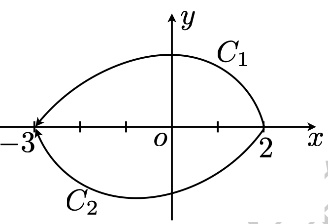
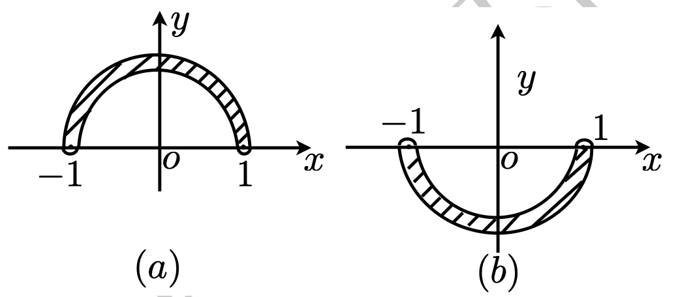

# 复变函数 第3次作业

Chasse_neige

4.判断下列函数是否为多值函数, 若为多值函数, 请分析其支点的情况

(1) $\sqrt{1 - z^3}$

是多值函数

可能支点：$z = 1, z = - \frac{1}{2} + \frac{\sqrt{3}}{2} i, - \frac{1}{2} - \frac{\sqrt{3}}{2} i, z = \infty$

判断

1. $z=1$：此时$z$绕行一圈后$w$ 的辐角变化 $\pi$，是支点
2. $z = - \frac{1}{2} + \frac{\sqrt{3}}{2} i$：此时$z$绕行一圈后$w$ 的辐角变化$\pi$，是支点
3. $z = - \frac{1}{2} - \frac{\sqrt{3}}{2} i$：此时$z$绕行一圈后$w$ 的辐角变化$\pi$，是支点
4. 无穷远点：此时$z$绕行一圈后$w$ 的辐角变化$3 \pi$，是支点

(2) $\sqrt[3]{z^2 - 1}$

是多值函数

可能支点：$z = 1, z = -1, z = \infty$

判断

1. $z = 1$：此时$z$绕行一圈后$w$ 的辐角变化$\frac{2}{3} \pi$，是支点
2. $z = - 1$：此时$z$绕行一圈后$w$ 的辐角变化$\frac{2}{3} \pi$，是支点
3. 无穷远点：此时$z$绕行一圈后$w$ 的辐角变化$\frac{4}{3} \pi$，是支点

(3) $\sqrt{\cos z}$

是多值函数

可能支点：$\cos z = 0$，即 $z = \frac{\pi}{2} + k \pi$

判断

$z = \frac{\pi}{2} + k \pi \quad (k \in \mathbb{Z})$：此时$z$绕行一圈后$w$ 的辐角变化$\pi$，是支点

(6)$\frac{\sin \sqrt{z}}{\sqrt{z}}$

是多值函数

可能支点：$\sin \sqrt{z} = 0$，即$z = k^{2} \pi^{2}$

判断

1. $z = 0$ ： 此时 $z$ 绕行一圈之后 $w$ 的辐角变化为 $0$ ，不是支点
2. $z = k^{2} \pi^{2} \quad (k \neq 0)$ ： 此时 $z$ 绕行一圈之后 $w$ 的辐角变化为 $\pi$ ，是支点

5.函数 $w (z) = z + \sqrt{z - 1}$, 规定 $w(2) =1$, 试分别求当 $z$ 沿着图中 $C1$ 和 $C2$连续变化时 $w(−3)$ 的值

函数支点为 $z = 1$ 以及无穷远点，由于 $w (2) = 1$，所以函数在 $x$ 轴正半轴上辐角为 $2 \pi$

$z$ 沿着图中 $C1$ 变化时
$$
w (-3) = 3 e^{i 3 \pi} + |\sqrt{-3 - 1}| e^{i \frac{3 \pi}{2}} = -3 - 2 i
$$
$z$ 沿着图中 $C2$ 变化时 
$$
w(-3) = 3 e^{i \pi} + |\sqrt{-3 -1}| e^{i \frac{\pi}{2}} = -3 + 2i
$$

7.函数 $\ln \frac{1 - z}{1 + z}$, 规定 $w(0) = 0$, 试讨论当 $z$ 分别限制在图 $(a)$ 和 $(b)$ 中变化时, $w(3)$ 为多少? $w(∞)$ 又是多少?

当 $z$ 限制在图 $(a)$  中变化时

$$
w (3) = \ln \left( \left| \frac{1 - 3}{1 + 3} \right| e^{i (\pi - 0)} \right) = - \ln 2 + i \pi
$$

$$
w (\infty) = \ln \left( \left| -1 \right| e^{i \pi} \right) = i \pi
$$

当 $z$ 限制在图 $(b)$  中变化时
$$
w (3) = \ln \left( \left| \frac{1 - 3}{1 + 3} \right| e^{i (- \pi - 0)} \right) = - \ln 2 - i \pi
$$

$$
w (\infty) = \ln ( \left| -1 \right| e^{- i \pi}) = - i \pi
$$

8.设 $f(z)=\dfrac{z^{1-p}(1-z)^p}{2 z}$ ， $-1 < p < 2$ ，取割线为实轴上从 $0$ 到 $1$ 的线段，且割线上岸辐角为 $0$ 。试求 $f(\pm \mathrm{i})$ ， $ f(\infty)$  
$$
f  (i) = \left| \frac{i^{1 - p} (1 - i)^{p}}{2 i} \right| e^{i ((1 - p) \frac{\pi}{2}- p \frac{\pi}{4} - \frac{\pi}{2})} = 2^{\frac{p}{2} - 1} e^{- i p \frac{3 \pi}{4}}
$$

$$
f(- i) = \left| \frac{(-i)^{1 - p} (1 + i)^{p}}{- 2 i} \right| e^{i ((1 - p) \frac{3 \pi}{2} + p \frac{\pi}{4} - \frac{3 \pi}{2})} = 2^{\frac{p}{2} - 1} e^{- i p \frac{5 \pi}{4}}
$$

$$
f (\infty) = \left| \frac{1}{2} \right| e^{i (p (- \pi) - 0)} = \frac{1}{2} e^{- i p \pi}
$$