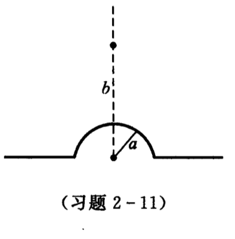

# 电动力学 第12周作业

 Chasse_neige

### 1. 静电势及其微分方程

电势及其满足的微分方程，非极值定理 
作业: 
(a) 书2.1  

2.1 计算

一个半径为 $R$ 的电介质球,极化强度为 $\vec{P}=K\frac{\vec{r}}{r^2}$,电容率为 $\epsilon$.

(1) 计算束缚电荷的体密度和面密度 

$$
\rho' = - \nabla \cdot \vec{P} = - K \nabla \cdot \frac{\vec{r}}{r^{2}} = - \frac{K}{r^{2}}
$$

$$
\sigma' = \hat{n} \cdot \vec{P} = \frac{K}{R}
$$

(2) 计算自由电荷体密度
$$
\vec{D} = \epsilon_{0} \vec{E} + \vec{P}
$$

$$
 (1 - \frac{\epsilon_{0}}{\epsilon}) \vec{D} = \vec{P}
$$

$$
\vec{D} = \frac{\epsilon}{\epsilon - \epsilon_{0}} \vec{P}
$$

$$
\rho_{0} = \nabla \cdot \vec{D} = \frac{\epsilon K}{\epsilon - \epsilon_{0}} \nabla \cdot \frac{\vec{r}}{r^{2}} = \frac{\epsilon K}{(\epsilon - \epsilon_{0}) r^{2}}
$$

(3) 计算球外和球内的电势 

球外
$$
\begin{aligned}
Q &= \int_{0}^{R} \left( \frac{\epsilon K}{(\epsilon - \epsilon_{0}) r^{2}} - \frac{K}{r^{2}} \right) 4 \pi r^{2} d r + 4 \pi R^{2} \frac{K}{R} = \frac{\epsilon K}{\epsilon - \epsilon_{0}} 4 \pi R \\\\
\phi (r) &= \frac{1}{4 \pi \epsilon_{0}} \frac{Q}{r} = \frac{\epsilon KR}{(\epsilon - \epsilon_0)\epsilon_0 r}
\end{aligned}
$$
球内
$$
Q (r) = \int_{0}^{r}  \left( \frac{\epsilon K}{(\epsilon - \epsilon_{0}) r^{2}} - \frac{K}{r^{2}} \right) 4 \pi r^{2} d r = \frac{\epsilon_{0} K}{\epsilon - \epsilon_{0}} 4 \pi r
$$

$$
\vec{E} (r) = \frac{K}{(\epsilon - \epsilon_{0}) r} \hat{r}
$$

$$
\phi (r) = \frac{\epsilon K}{(\epsilon - \epsilon_0)\epsilon_0} + \int_{r}^{R} \frac{K}{\epsilon - \epsilon_{0}} \frac{d r}{r} = \frac{K}{\epsilon - \epsilon_0}(\ln \frac{R}{r} + \frac{\epsilon}{\epsilon_0})
$$

(4) 求该带电介质球产生的静电场总能量
$$
\begin{aligned}
W_{E} &= \int_{0}^{R} \frac{1}{2} \epsilon_{0} (\frac{K}{(\epsilon - \epsilon_{0}) r})^{2} 4 \pi r^{2} d r + \int_{R}^{\infty} \frac{1}{2} \epsilon_{0} (\frac{\epsilon KR}{(\epsilon - \epsilon_0)\epsilon_0 r^{2}})^{2} 4 \pi r^{2} d r \\\\
&= 2\pi \epsilon R \left(1 + \frac{\epsilon}{\epsilon_0}\right) \left(\frac{K}{\epsilon - \epsilon_0}\right)^2
\end{aligned}
$$
(b) 试证:极化电荷出在自由电荷处,无自由电荷也无极化电荷,极化使自由电荷处的总电荷变为原来的$\frac{1}{\epsilon_r}$倍.  

证明

线性极化假设下
$$
\vec{D} = \epsilon_{0} \vec{E} + \vec{P} = \epsilon \vec{E}
$$
所以
$$
\vec{P} = (1 - \frac{\epsilon_{0}}{\epsilon}) \vec{D}
$$

$$
\nabla \cdot \vec{P} = (1 - \frac{\epsilon_{0}}{\epsilon}) \nabla \cdot \vec{D}
$$

$$
- \rho' = (1 - \frac{\epsilon_{0}}{\epsilon}) \rho_{0}
$$

所以极化电荷出在自由电荷处

总电荷
$$
\rho = \rho_{0} + \rho' = \frac{\epsilon_{0}}{\epsilon} \\ \rho_{0} = \frac{1}{\epsilon_{r}} \rho_{0}
$$
(c) 试证:对无穷大均匀电介质,有介质时的电势和电场是无介质时的$\frac{1}{\epsilon_r}$倍.

证明

假设自由电荷分布不变，有介质之后

线性极化假设下
$$
\vec{D} = \epsilon_{0} \vec{E} + \vec{P} = \epsilon \vec{E}
$$
所以
$$
\vec{P} = (1 - \frac{\epsilon_{0}}{\epsilon}) \vec{D}
$$

$$
\nabla \cdot \vec{P} = (1 - \frac{\epsilon_{0}}{\epsilon}) \nabla \cdot \vec{D}
$$

$$
- \rho' = (1 - \frac{\epsilon_{0}}{\epsilon}) \rho_{0}
$$

总电荷变为
$$
\rho = \rho_{0} + \rho' = \frac{\epsilon_{0}}{\epsilon} \rho_{0} = \frac{1}{\epsilon_{r}} \rho_{0}
$$
根据叠加原理
$$
\phi  = \int d \tau' \frac{\rho_{0}}{4 \pi \epsilon_{0} \epsilon_{r}|\vec{r} - \vec{r}'|}
$$

$$
\vec{E} = \int d \tau' \frac{\rho_{0} (\vec{r} - \vec{r}')}{4 \pi \epsilon_{0} \epsilon_{r}|\vec{r} - \vec{r}'|^{3}}
$$

所以场强和电势都变为无介质时的$\frac{1}{\epsilon_r}$倍.

### 2. 唯一性定理及应用

静电问题唯一性定理，有导体存在时的唯一性定理 
作业： 
(a) 由一组导体组成的体系,已知第$i$个导体上的总电荷为$q_i$,且导体外可以有介质,但无自由电荷,试证空间任一点 $\vec{r}$ 处的电势与 $q$ 的关系为:  $\phi(\vec{r}, q_1, q_2, \ldots) = \sum_i p_i(\vec{r}) q_i$，其中$p_i(\vec{r})$与导体上电荷无关. 

证明

由唯一性定理，只要说明满足边界条件
$$
\begin{aligned}
\oint_{S_{i}} d S \frac{\partial}{\partial n_{i}}  \sum_i p_i(\vec{r}) q_i &= - \frac{q_{i}}{\epsilon} \\\\
\sum_i p_i(\vec{r}) q_i &= \phi_{i} \qquad (\vec{r} \in S_{i})
\end{aligned}
$$
的解存在，那么这个解就是唯一解
$$
\begin{aligned}
\oint_{S_{i}} d S \frac{\partial}{\partial n_{i}}  \sum_i p_i(\vec{r}) q_i &= \int_{S_{i}} d \vec{S} \cdot \nabla (\sum_{i} p_{i} (\vec{r}) q_{i}) \\\\
&= \int_{V_{i}} d \tau \nabla \cdot \nabla  (\sum_{i} p_{i} (\vec{r}) q_{i}) = \int_{V_{i}} d \tau \nabla^{2}  (\sum_{i} p_{i} (\vec{r}) q_{i}) = - \frac{q_{i}}{\epsilon}
\end{aligned}
$$
不妨令
$$
p_{i} (\vec{r}) = \frac{1}{ 4 \pi \epsilon} \int_{V_{i}} \frac{\rho_{i} (\vec{r}') d \tau'}{ |\vec{r} - \vec{r}'|}
$$

$$
\begin{aligned}
\int_{V_{i}} d \tau \nabla^{2}  (\sum_{i} p_{i} (\vec{r}) q_{i}) &= \int_{V_{i}} d \tau \sum_{i} \frac{q_{i}}{ 4 \pi \epsilon} \nabla^{2} \int_{V_{i}} \frac{\rho_{i} (\vec{r}') d \tau'}{ |\vec{r} - \vec{r}'|} = - \frac{q_{i}}{\epsilon} \int_{V_{i}} d \tau \sum_{i} \int_{V_{i}} d \tau' \rho_{i} (\vec{r'}) \delta (\vec{r} - \vec{r'}) \\\\
&= - \frac{q_{i}}{\epsilon} \int_{V_{i}} d \tau \rho_{i} (\vec{r})
\end{aligned}
$$

所以
$$
\int_{V_{i}} d \tau \rho_{i} = 1
$$
再证明存在这样一组 $\rho_{i}$ 能够让所有导体表面等势，即满足
$$
\sum_{i}  \frac{q_{i}}{ 4 \pi \epsilon} \int_{V_{i}} \frac{\rho_{i} (\vec{r}') d \tau'}{ |\vec{r} - \vec{r}'|} = \phi_{i} \qquad (\vec{r} \in S_{i})
$$
注意到取 $q_{i} \rho_{i}$ 为平衡时，那个导体的面电荷密度满足条件，即
$$
\begin{aligned}
\rho_{i} (\vec{r}) = \begin{cases} 0 & (\vec{r} \in V_{i}/\overset{\circ}{V_{i}}) \\\\
\frac{\sigma_{i}}{q_{i}} \delta (\hat{n}) & (\vec{r} \in \partial V_{i}) \end{cases}
\end{aligned}
$$
满足条件。所以解存在，即唯一解为
$$
p_{i} (\vec{r}) = \int_{S_{i}} \frac{\sigma_{i} (\vec{r'})}{4 \pi \epsilon |\vec{r} - \vec{r'}|} d S
$$
(b) 一导体空腔内有电荷$Q$,在导体绝缘和接地两种情况下,试用唯一性定理讨论导体内表面和外表面的电荷密度是否会变化?

内表面电荷不变，外表面在绝缘时和内表面带反号电荷，在接地时不带电

证明

对于导体空腔内的空间，接地前后边界条件不改变，由唯一性定理，空腔内的电势分布不改变，所以内表面电荷密度
$$
\sigma_{\text{内}} = -  \frac{\partial \phi}{\partial n}
$$
不改变

对于外空间，接地之后边界电势变为0，此时对于外空间，猜解
$$
\phi = 0
$$
由唯一性定理，外空间电势处处为0

所以此时外表面带电量为0，电荷密度出处为0

但是接地之前，由于导体整体不带电，所以外表面带电量为内表面的相反数不为0

所以外表面电荷密度会变化

### 3. 镜像法

作业:书2.9, 2.11

2.9 接地的空心导体球

接地的空心导体球的内外半径为 $R_1$ 和 $R_2$,在球内离球心为 $a(a<R_1)$ 处置一点电荷 $Q$. 用镜像法求电势. 导体球上的感应电荷有多少? 分布在内表面还是外表面?

像电荷大小为$- \frac{a}{R_{1}} Q$ ，距离球心$\frac{R_{1}^{2}}{a}$

所以电势分布为
$$
\phi (r, \theta) =  \frac{1}{4\pi \epsilon_0} \left( \frac{Q}{\sqrt{R^2 + a^2 - 2Ra \cos \theta}} - \frac{\frac{R_{1}}{a} Q}{\sqrt{R^2 + \frac{R_1^2}{a^2} - \frac{2R_1^2 R}{a} \cos \theta}} \right)
$$
感应电荷分布于内表面,总电荷量为 $-Q$

2.11 接地的导体平面

在接地的导体平面上有一半径为 $a$ 的半球凸部(如图), 半球的球心在导体平面上, 点电荷 $Q$ 位于系统的对称轴上, 并与平面相距为 $b(b>a)$, 试用镜像法求空间电势.

三个像电荷分别在$\frac{a^{2}}{b}$，$- \frac{a^{2}}{b}$ ，$-b$ 处，大小为$-\frac{b}{a} Q$，$\frac{b}{a} Q$ ，$-Q$

空间电势分布为
$$
\begin{aligned}
\phi (x, y, z) &= \frac{1}{4 \pi \epsilon_{0}} ( \frac{Q}{\sqrt{x^{2} + y^{2} + (z - b)^{2}}} - \frac{Q}{\sqrt{x^{2} + y^{2} + (z + b)^{2}}} \\\\
& - \frac{\frac{b}{a}Q}{\sqrt{x^{2} + y^{2} + (z - \frac{a^{2}}{b})^{2}}} + \frac{\frac{b}{a}Q}{\sqrt{x^{2} + y^{2} + (z + \frac{a^{2}}{b})^{2}}} )
\end{aligned}
$$
